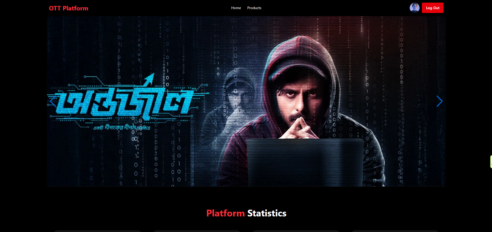

# 🎬 OTT Platform  

An OTT (Over-The-Top) streaming platform built with **Next.js 15, NextAuth, TailwindCSS, and Express.js backend**.  
This platform allows users to browse and watch movies, series, and dramas. Admins can add new products, and users can log in to manage their profiles.  

---

## 🌐 Live Demo  
🔗 [Visit Live Site](https://ott-platform-client.vercel.app/)  

---

## 📸 Screenshot  
  

---

## ✨ Features  
- 🔥 Modern & engaging **Landing Page** with black & red theme  
- 🎥 **Add Product Page** → Admin can add movies, series, and dramas  
- 📂 **Products Page** → Browse all available content (movies, series, dramas)  
- 📄 **Product Details Page** → Individual details with name, description, and price/plan  
- 🔐 **User Authentication** with NextAuth (Google login supported)  
- 📱 Fully responsive design (mobile-first with TailwindCSS)  

---

## 🛠️ Tech Stack  
- **Frontend**: Next.js 15, TailwindCSS, NextAuth  
- **Backend**: Express.js, MongoDB  
- **Authentication**: NextAuth.js  
- **Styling**: TailwindCSS (Black & Red theme)  

---

## 🚀 Setup & Installation  

### 1️⃣ Clone the repository  
```bash
git clone https://github.com/Rakiful/ott-platform-client.git
cd ott-platform
